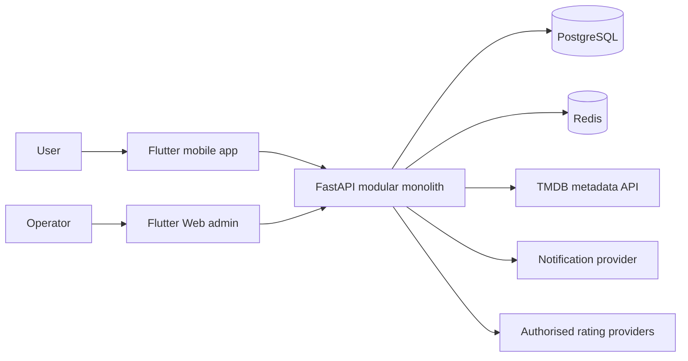

# Architecture overview

## Architectural intent

Cineara is a monorepo containing an Android-first Flutter client, a FastAPI modular monolith, PostgreSQL, Redis, shared contracts and a later internal administration application.

The architecture prioritizes a coherent domain model, explicit policy enforcement, offline-capable personal tracking and manageable deployment. It deliberately avoids microservices until independent scaling or organizational boundaries provide a concrete need.

## System context



## Repository boundaries

### `mobile/`

Flutter consumer application. It owns presentation, local persistence, offline operations, client-side capability configuration and safe rendering. It never owns the authoritative catalogue ceiling or third-party API credentials.

### `backend/`

FastAPI modular monolith. It owns catalogue normalization, app-client capability enforcement, account data, synchronization, recommendations, progression, external-service integration and server-authoritative decisions.

### `admin/`

Internal operations application introduced later. It uses role-based APIs to manage classifications, discovery hubs, progression definitions, links, moderation and audit history.

### `packages/`

Shared Dart packages, initially the Cineara design system, API client, lints and test utilities.

### `contracts/`

Versioned OpenAPI, event and configuration schemas. Generated clients consume contracts; raw backend implementation models do not leak into Flutter.

### `infrastructure/`

Docker, environment, deployment, monitoring, backup and hosted-resource definitions.

### `docs/`, `legal/`, `scripts/`, `store-assets/`

Product/technical contracts, legal surfaces, repeatable operational tooling and distribution assets.

## Backend modular monolith

Each major domain is a module with a stable public service/API boundary. Typical module contents are:

```text
api.py
schemas.py
models.py
repository.py
service.py
policies.py
selectors.py
events.py
exceptions.py
```

Modules may share infrastructure through `core/` but must not reach directly into another module's persistence implementation. Cross-domain side effects use service calls or domain events.

Initial domain sequence:

```text
App clients and content policy
    ↓
Catalogue and search
    ↓
Discovery, details, people and releases
    ↓
Library, progress and ratings
    ↓
Home, picks, collections and calendar
    ↓
Achievements, challenges, ranks and statistics
    ↓
Community and moderation
```

## Data ownership

| Data                                      | Authoritative owner                       |
|-------------------------------------------|-------------------------------------------|
| Raw source metadata                       | External provider, cached by backend      |
| Cineara media identity and classification | Backend catalogue module                  |
| App-client catalogue ceiling              | Backend app-client/content-policy modules |
| User's unsynchronised guest changes       | Mobile local database                     |
| Synchronised account library and XP       | Backend                                   |
| Local UI preferences                      | Mobile, optionally synchronised           |
| Achievement/challenge definitions         | Backend configuration/administration      |
| Public reviews and moderation state       | Backend                                   |
| Screen presentation state                 | Mobile                                    |

## Mobile architecture

Flutter features follow a pragmatic feature-first clean separation:

```text
feature/
├── data/          DTOs, data sources, mappers, repository implementations
├── domain/        Product models, policies and repository interfaces
└── presentation/  Controllers, state, screens and widgets
```

Shared domain policies such as catalogue visibility and progress formulas are represented in tests on both client and server. The server remains authoritative when synchronized data or restricted content is involved.

## Offline model

The personal library, progress, ratings, collections and key cached metadata are available offline.

Write flow:

```text
User action
    ↓
Local transaction
    ↓
Optimistic UI + Undo
    ↓
Queued sync operation
    ↓
Backend idempotent command
    ↓
Acknowledgement or deterministic conflict resolution
```

Catalogue browsing may use stale cached content with a visible freshness indicator. Hidden content policy is reapplied whenever build/user capability changes.

## Event model

Durable domain events connect tracking actions to activity, achievements, challenges, XP, statistics and notifications.

Properties:

- stable event identifier;
- event type and schema version;
- actor/user identifier where applicable;
- source entity and idempotency key;
- occurrence and processing timestamps;
- provenance, including guest import or manual correction.

The backend uses a transactional outbox so database state and emitted events cannot diverge silently.

## Content-policy enforcement

Policy is evaluated before data is returned, not only when widgets render.

```text
Verified app client ceiling
    + user visibility preference
    + regional/source constraints
    = effective catalogue visibility
```

The same decision applies to search, direct details, credits, recommendations, notifications, caches and deep links.

## External integrations

- TMDB metadata is mapped into Cineara schemas; raw responses are never the mobile API contract.
- Third-party credentials remain on the backend.
- Provider availability, verified deep links and fallback links are separate concepts.
- IMDb or Rotten Tomatoes ratings are displayed only through authorized integrations; otherwise Cineara exposes safe external links.
- External URLs are allow-listed, validated and labeled by quality.

## Security baseline

Later implementation must include:

- request IDs and structured logs;
- authenticated and authorized account/admin routes;
- rate limiting;
- secure token storage;
- secret management outside source control;
- app-client verification for capability-sensitive routes;
- idempotent mutation endpoints;
- audit logging for administrative changes;
- no sensitive data in logs.

## Observability and operations

The production system includes health/readiness probes, metrics, traces, task monitoring, database backups and restore procedures. Background jobs refresh metadata, upcoming releases, providers, daily picks, achievements and statistics.

## Architecture decisions intentionally deferred

Phase 0 does not select exact Flutter state management, local database library, cloud provider, authentication vendor or background-task framework. These choices must satisfy the product contracts and be recorded as architecture decisions during the relevant implementation phase.
