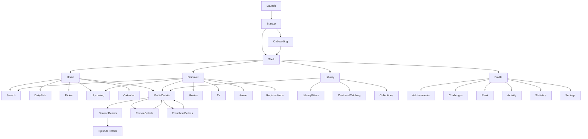

# Navigation map

## Navigation principles

- The primary bottom navigation contains **Home**, **Discover**, **Library** and **Profile**.
- Search is globally reachable from Home and Discover.
- Calendar, Picker, Daily Pick, Achievements and Rank are prominent destinations but do not overload the bottom bar.
- Each bottom-tab branch preserves its own navigation stack.
- Deep links enter through the same route guards and catalogue policy as in-app navigation.
- Modal sheets are used for filters, quick actions and compact edits; full workflows use screens.

## Primary hierarchy



## Route inventory

Routes are conceptual during Phase 0. Concrete Flutter route names are introduced with the application shell.

| Destination | Entry points | Purpose | Scope |
|---|---|---|---|
| Startup/Splash | App launch | Resolve configuration, database, session and safe initial route. | V1 |
| Onboarding | First launch | Explain discovery, tracking, picker and privacy; collect minimal preferences. | V1 |
| Authentication | Profile, sync prompt | Optional sign-in, registration and account recovery. | V1 |
| Home | Bottom navigation | Configurable overview of featured, progress, picks, upcoming and progression content. | V1 |
| Home layout | Home settings | Reorder, enable and configure Home sections. | V1 |
| Search | Home/Discover action | Search media and people with type filters and recent history. | V1 |
| Discover | Bottom navigation | Entry point for Movies, TV, Anime, regional hubs and upcoming content. | V1 |
| Media discover | Discover | Filter and sort one media category. | V1 |
| Regional hubs | Discover | Browse country, language, genre and editorial discovery hubs. | V1 |
| Discovery hub | Regional hubs/Home | Show configurable sections for one hub. | V1 |
| Upcoming | Home/Discover | Separate upcoming movies, series and episodes. | V1 |
| Daily Pick | Home | Present one explainable suggestion with replace, dismiss and snooze. | V1 |
| Picker configuration | Home/Discover | Select sources, media types, providers, runtime and random mode. | V1 |
| Picker result | Picker | Reveal a result and support open, reject, pick again or mark watched. | V1 |
| Picker history | Picker | Review recent results and saved presets. | V1 |
| Movie details | Cards, search, deep link | Explain a movie and expose tracking, ratings, providers, people and relations. | V1 |
| Series details | Cards, search, deep link | Explain a series and expose seasons, progress, providers, people and relations. | V1 |
| Season details | Series details | Show season metadata, standard progress, runtime and episode list. | V1 |
| Episode details | Season details, calendar | Show synopsis, progress, rating, cast, crew and adjacent episodes. | V1 |
| Person details | Credits and search | Show biography and role-based movie, TV and anime credits. | V1 |
| Franchise details | Media details | Show ordered cross-media franchise members and relations. | V1 |
| Library | Bottom navigation | Browse personal titles by lifecycle status, favourite flag, type and progress. | V1 |
| Library item editor | Library/details | Edit status, favourite, dates, notes, rewatches and progress controls. | V1 |
| Continue Watching | Home/Library | Resume titles with eligible remaining standard progress. | V1 |
| Collections | Library | Manage private mixed-media collections used by the picker. | V1 |
| Collection details/editor | Collections | View, order, annotate and edit collection members. | V1 |
| Calendar | Home/Profile | View agenda, week and month release schedules. | V1 |
| Notification settings | Settings/Calendar | Configure release and progression notifications. | V1 |
| Achievements | Home/Profile | Browse one-time and repeatable progress and unlock history. | V1 |
| Achievement details | Achievements | Explain criteria, progress, rarity, completions and rewards. | V1 |
| Challenges | Profile/Achievements | Show active daily, weekly, monthly and seasonal objectives. | V1 |
| Rank details | Home/Profile | Show rank, XP curve position, history and next threshold. | V1 |
| Activity | Profile | Private chronological viewing and contribution history. | V1 |
| Statistics | Profile | Private watch-time, genre, country, language and streak summaries. | V1 |
| Reviews | Media details | Browse public reviews with spoiler controls. | Later |
| Review editor/details | Reviews | Create, edit, discuss and report reviews. | Later |
| Profile | Bottom navigation | User identity, progression summary, history and account entry points. | V1 |
| Settings | Profile | Appearance, region, language, providers, privacy, content and data controls. | V1 |
| Content preferences | Settings/onboarding | Control mature/adult visibility within the immutable build ceiling. | V1 |
| Privacy and data | Settings | Export, account deletion, consent and attribution access. | V1/Later |
| Admin application | Separate web app | Operate catalogue overrides, hubs, progression and moderation. | Later |

## Bottom-tab state preservation

Each tab owns a nested stack:

```text
Home stack      Home -> Daily Pick -> Media Details
Discover stack  Discover -> Anime -> Media Details -> Person
Library stack   Library -> Collection -> Media Details
Profile stack   Profile -> Achievements -> Achievement Details
```

Switching tabs preserves the current stack. Reselecting the active tab returns to its root or scrolls the root to top, according to platform conventions.

## Deep links

Initial deep-link shapes:

```text
/cineara/media/{cinearaId}
/cineara/person/{cinearaId}
/cineara/season/{seriesId}/{seasonNumber}
/cineara/episode/{seriesId}/{seasonNumber}/{episodeNumber}
/cineara/franchise/{cinearaId}
/cineara/calendar/{date}
/cineara/achievement/{achievementId}
/cineara/challenge/{challengeInstanceId}
```

Every deep link must:

1. pass build and user catalogue policy;
2. resolve authentication only when the destination requires it;
3. show a safe unavailable state rather than leaking hidden metadata;
4. preserve the original intended destination through optional sign-in;
5. validate external URLs separately before leaving the app.

## Back navigation

- Android system Back pops the active nested stack.
- At a tab root, Back follows platform exit behaviour.
- Dismissing a modal restores the unchanged underlying screen.
- A notification deep link opens a valid stack so Back returns to a meaningful Cineara screen, not an empty activity.
